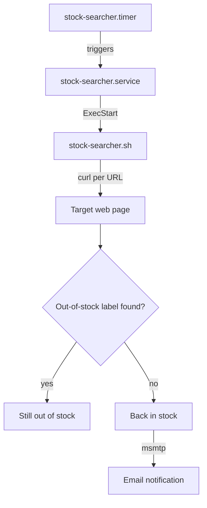

# stock-searcher

A small shell script + systemd timer that periodically checks whether specific products are back in stock on given web pages, 
and sends an email notification when they are.

## How it works

`stock-searcher.sh` fetches each configured URL with `curl` (spoofing a browser `User-Agent` to avoid being blocked), 
and checks whether a given out of stock label is present in the page content:

- If the label **is** found => the product is still out of stock, nothing happens.
- If the label **is not** found => the product is considered available, and an email notification is sent via `msmtp`.

## Architecture





## Configuration

Products to watch are declared directly in `stock-searcher.sh`, as a bash associative array:

```bash
declare -A urls_to_check=(
  ["Label"]="https://example.com/product-page|Out of stock text to look for"
)
```

Each entry maps a human-readable label to `url|out_of_stock_label`, separated by `|`.

### Environment

The script relies on `msmtp` being installed and configured on the machine, and on the
`STOCK_SEARCHER_DESTINATION_MAIL` environment variable being set to the destination email address:

```bash
export STOCK_SEARCHER_DESTINATION_MAIL="you@example.com"
```

## Installation

This repo ships a `.service` and a `.timer` unit to run the check automatically every day.

1. Adjust the paths in `stock-searcher.service` (`WorkingDirectory`, `ExecStart`) and the `User` to match your setup.
2. Install the units:

```bash
sudo cp stock-searcher.service stock-searcher.timer /etc/systemd/system/
sudo systemctl daemon-reload
sudo systemctl enable --now stock-searcher.timer
```